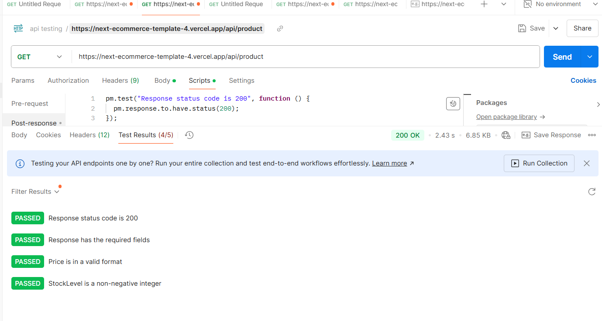

# Hecto Marketplace - Performance Testing Report

## 1. Introduction
This report outlines the performance testing conducted on the Hecto Marketplace website using Google Lighthouse and Postman. The goal was to evaluate website speed, responsiveness, and API efficiency.

## 2. Tools Used
- **Google Lighthouse:** For analyzing website performance, accessibility, SEO, and best practices.
- **Postman:** For testing API response times, reliability, and efficiency.

## 3. Lighthouse Performance Report
- **Device Type:** [Desktop/Mobile]  
- **Tested Pages:** [Homepage, Product Page, Wishlist, Cart]  

### Key Metrics:
- **Performance Score:** [Insert Score]%
- **First Contentful Paint (FCP):** [Insert Time] ms
- **Speed Index:** [Insert Time] ms
- **Largest Contentful Paint (LCP):** [Insert Time] ms
- **Time to Interactive (TTI):** [Insert Time] ms
- **Total Blocking Time (TBT):** [Insert Time] ms
- **Cumulative Layout Shift (CLS):** [Insert Value]

### Findings:
- **Strengths:** [Fast loading times, minimal layout shifts, etc.]
- **Areas for Improvement:** [Optimize images, reduce JavaScript execution time, etc.]

https://docs.google.com/document/d/1OeYyj3FYG3cK0cwkB3uGgTFigQ-RsDRR22byfu2w2Yk/edit?usp=sharing

## 4. Postman API Performance Report

**Prepared by:** Zeenat Yameen (roll no: 479544)
**Slot:** Tuesday 2pm to 5pm  
**Project:** Hecto Marketplace Performance Report

